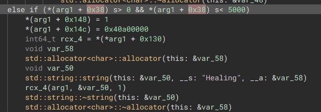
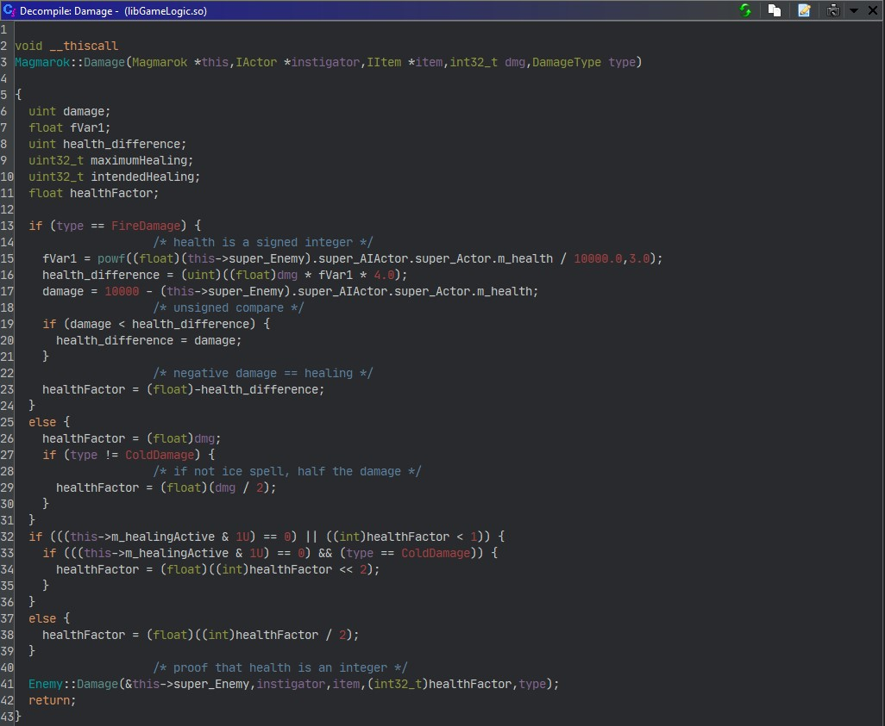

# Hook Magmarok Health

In Pwn Adventure, there is a challenge where you have to defeat a Boss who has 10,000 health points, he if a fire monster called Magmarok. The character is has a resistance to all weapons except Ice spells, and Fire spells actually heal him.

## The Damage Function

The `Magmarok` class has a `Damage` method. This is called every time Magmarok is hit with a weapon/spell. As annotated, there is a bug in this function.

There are two 'bugs' in this function. One is essentially a race condition. If Magmarok's health got < `int 5000` during a tick, he would trigger a healing function. The healing function takes about 2 seconds though, so there is a TOCTOU here.

(sorry, ghidra couldn't decouple it so here in Binja)

`Magmarok`'s health is stored as a signed integer, however the logic to ensure Magmarok does not heal is flawed. Since the comparison works with unsigned integers, if there `health_difference` is larger than `damage`. 

The race condition can be used to push his health > 10,000. After that, healing him with fireballs will keep pushing his health up until it overflows the 32 bit integer and flips to the negative. Then he's dead...

This actually doesn't require any changes on the client at all, but the whole process becomes **much** easier when his health can be viewed. This Frida script hooks the damage function to display his health when the function is called. With this, you can use ice spells to get him close to 5,000 then use a pistol to push him slowly lower, once he drops below 5000 just slam him with fireballs. if the health is > 10,000 after healing & fireballs then just keep going with fireballs until he dies :raised_hands: