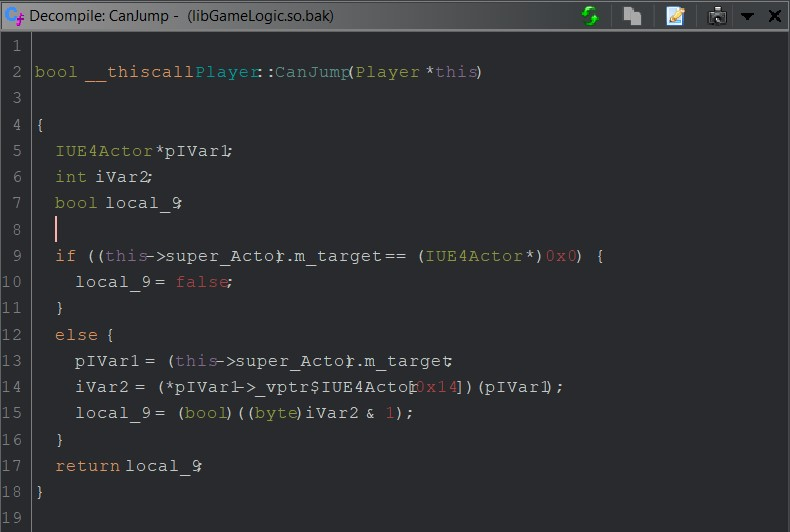
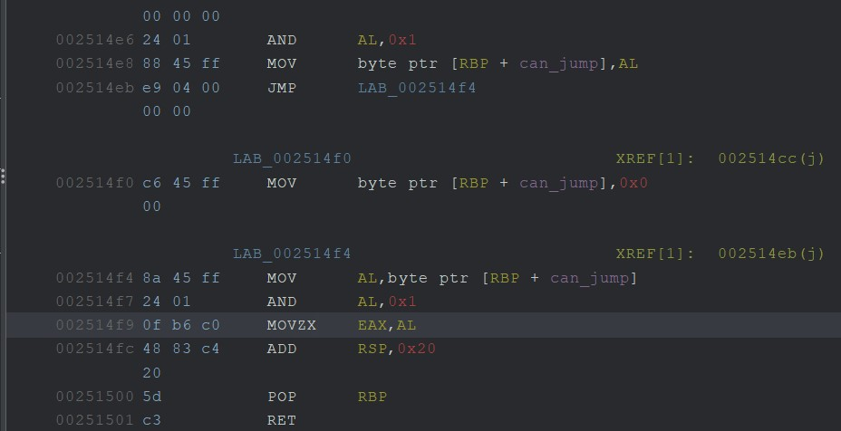
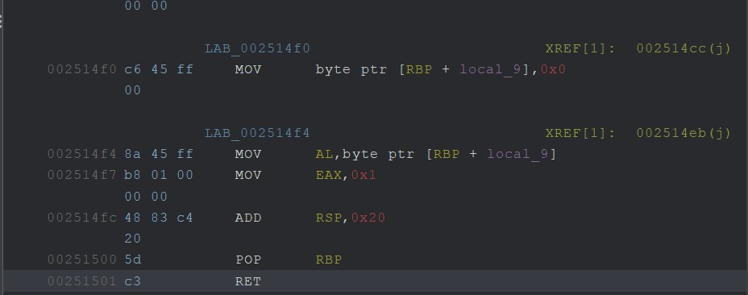

# # Jump Hack - Binary Patching

- Author: `sharkmoos`
- Difficulty: Super Easy

## Introduction

Similar to speed, there are a number of obstacles in Pwn Adventure that are higher than the defaut single-jump ability of the player. An easy way to fix this until a reliable teleport/fly hack is written is to simply alter the logic that decided whether a jump can take place.

## Finding a Target

The player class has a number of methods related to jumping


`CanJump` is an obvious thing to try and alter.



There is some logic in this line that basically decides whether the player is allowed to jump

```c++
iVar2 = (*pIVar1->_vptr$IUE4Actor[0x14])(pIVar1);
```

## Creating a Patch

A patch for this is way easier than with speed. Its a simple true/false, so lets force the function to always return true.






This works 


