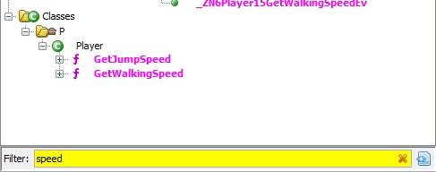
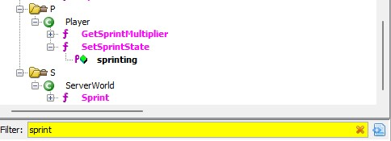
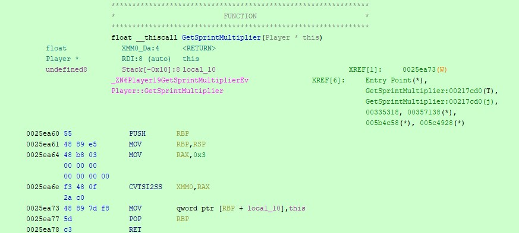
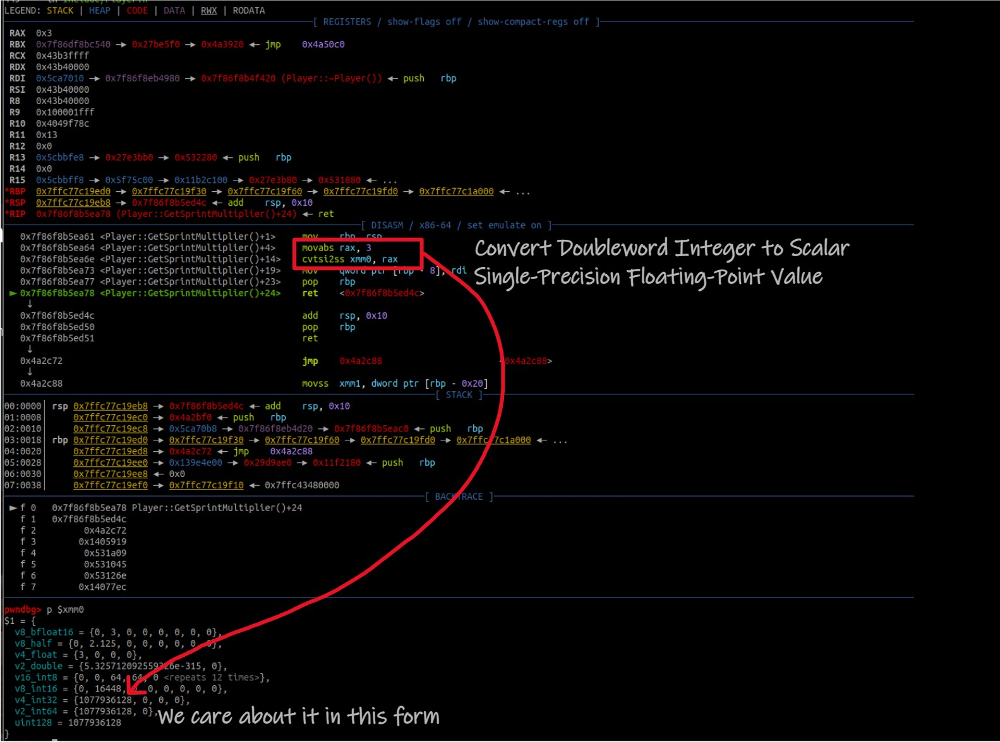
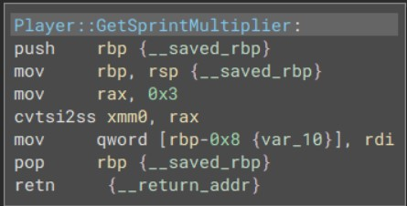
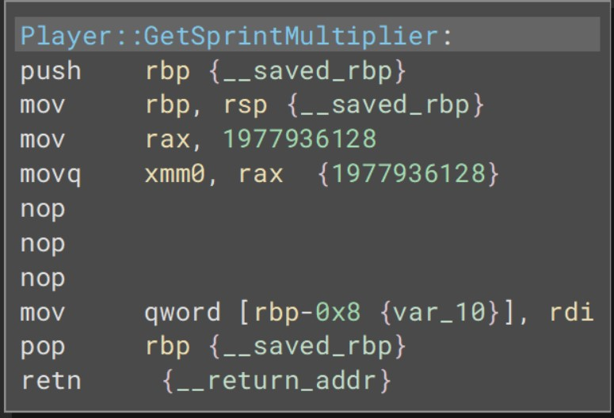

# Speed Hack - Binary Patching

- Author: `sharkmoos`
- Difficulty: Easy

## Introduction

The travel speed of characters in Pwn Adventure is pretty slow. CheatEngine/GDB/Frida etc could be used to provide a solution to this, but the exploit would need to be rerun every time the game starts. This binary patch provides a permanent solution.

## Finding a Target

The player class has a number of methods for the running/walking logic. Two contain the speed keyword

`GetSpringMultiplier` looks interesting... 

Yes. This is perfect. The function returns a floating point representation of the integer 3. This should be easy enough to patch.

## Creating a Patch

A little finesse is required here - it's the **floating point** value that is the focus. Simply changing 3 to 4 may not do what is intended. Instead, we can observe what value three is converted into via the `cvtsi2ss` instruction.

So the scalar value is `1077936128`. With a little trial and error, increasing that to `1977936128` works well. '*But you haven't shown how you actually did the patch*' - I hear you ask? 

The scalar conversion instructions are basically disposable now, so those instructions can be replaced with instructions to move `1977936128` into the xmm0 register.

